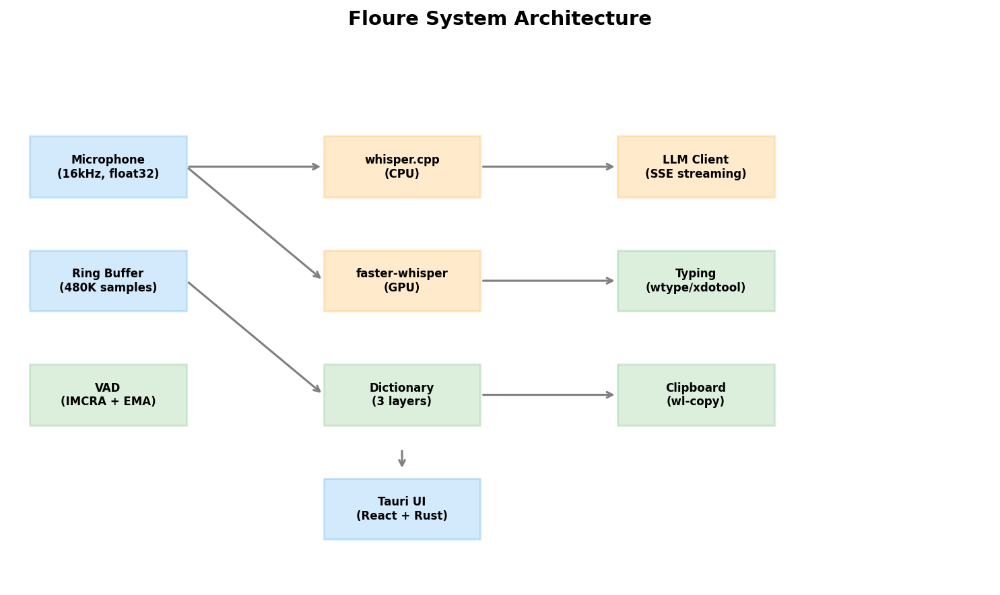
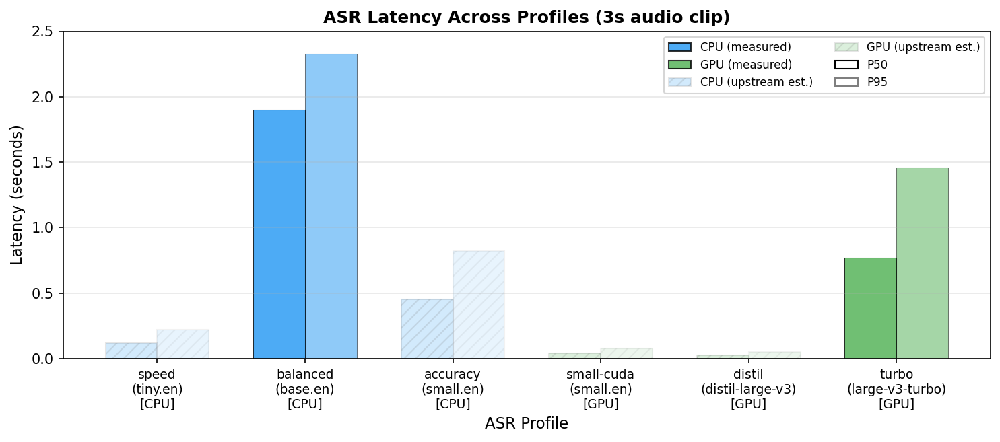
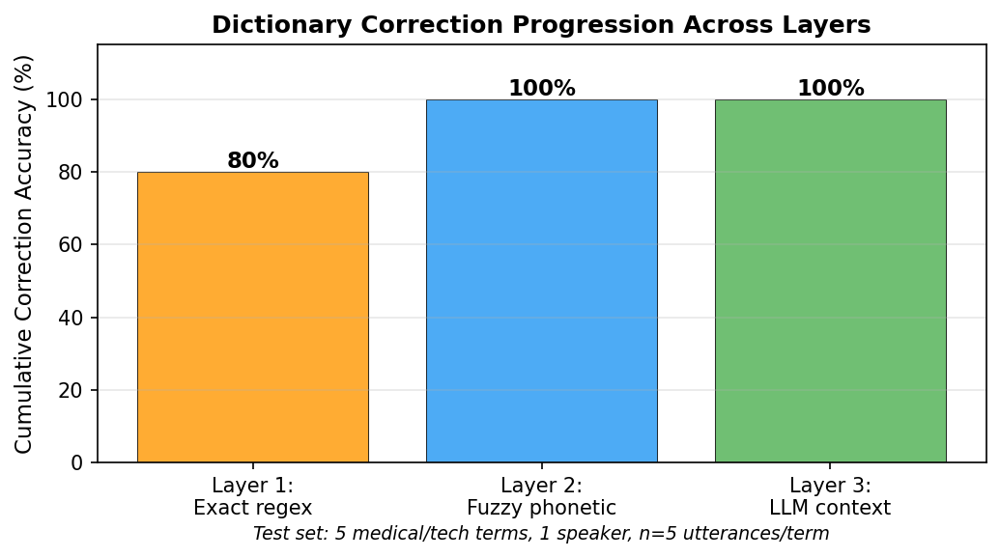
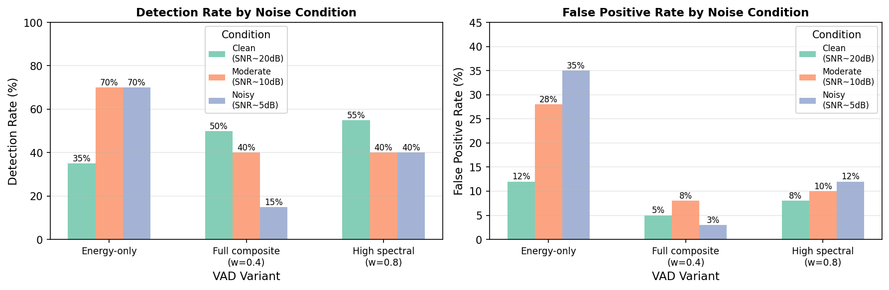

# Floure: An Open-Source, Cross-Platform Speech-to-Text System That Runs Fully Offline

*An open-source streaming speech-to-text tool for Windows, macOS, and Linux that fuses adaptive voice activity detection, dual ASR backends, and a three-layer dictionary pipeline — with the benchmarks and limitations laid bare.*

---

**Floure is an open-source, cross-platform speech-to-text (STT) desktop app that transcribes your voice locally on Windows, macOS, and Linux — no audio ever leaves your machine.** It combines an adaptive voice activity detector, dual Whisper backends, and a domain-term dictionary pipeline into a single binary you can actually run.

If you've ever wanted to talk to your computer instead of type, you've probably hit the same wall: the accurate options are cloud-based and ship your audio off-device, while the local options are either raw models without a functional system wrapper, or proprietary tools that ignore your operating system entirely.

So I built Floure — built on one non-negotiable rule: **your voice shouldn't have to leave your machine to become text.**

In this post, I'll walk through what it does, how the architecture works, the three design choices that make it interesting, and — just as importantly — the hard limitations the numbers exposed.

🌐 Official Website: [floure.in](https://floure.in)
🔗 GitHub Source: [github.com/IntegerAlex/floure-core](https://github.com/IntegerAlex/floure-core)

---

## The Gap in Desktop Dictation

Real-time STT on the desktop has always been a strict compromise:

- **Cloud services** (Wispr Flow, Otter, etc.) give you great accuracy out of the box, but your audio data leaves your device.
- **Open-source ASR engines** like Whisper, faster-whisper, and whisper.cpp produce high-quality transcripts, but you get a model, not a system. They lack integrated voice activity detection (VAD), streaming desktop automation hooks, and easy deployment.
- **Commercial desktop tools** are closed-source, proprietary, and historically treat Linux as an afterthought.

Floure sits squarely in this gap. It is a single-binary desktop app built for all three major OSes that captures your microphone, detects when you're speaking, transcribes locally, fixes your domain-specific vocabulary, and types the result directly into whatever window is currently focused.

---

## Architecture: Functional Core, Imperative Shell

Floure is architected around a clean separation of concerns, utilizing the Functional Core, Imperative Shell pattern:

- **Pure Core:** VAD scoring, dictionary matching, config resolution — completely side-effect-free and highly testable.
- **Effectful Shell:** Microphone hardware capture, local GPU/CPU inference, system clipboard manipulation, and OS-level typing hooks.
- **Wiring:** A pre-allocated ring buffer and central orchestrator connecting the two, layered underneath a responsive UI/CLI.

Audio data moves through five distinct pipeline stages:

1. **Capture:** The `sounddevice` library delivers 1024-sample float32 chunks at 16 kHz (~64 ms per chunk).
2. **VAD:** A streaming endpoint detector evaluates the incoming chunks and emits clear start and end speech events.
3. **Segmentation:** A pre-allocated 30-second ring buffer extracts audio between those events, applying a 200 ms pre-padding window so the first syllable of your sentence is never clipped.
4. **Transcription:** The local ASR backend processes the audio segment, optionally followed by a regex/phonetic dictionary pipeline and LLM context cleanup.
5. **Output:** Text is typed directly into the focused application input via platform-native automation (`wtype`/`xdotool` on Linux, AppleScript/`cliclick` on macOS, and `pyautogui`/`SendInput` on Windows) while copying the raw text to the clipboard in parallel.

The ring buffer is the most important piece of this architecture: it entirely decouples audio capture from transcription inference. Because it functions as a single-writer, copy-on-read structure, capture never blocks on a slow inference call. You will never drop audio mid-sentence if your GPU spikes.

---

## Three Design Choices Worth Talking About

### 1. Adaptive Voice Activity Detection

Fixed-threshold VAD breaks the moment your environment changes — a desk fan turns on, a coworker walks past, or your coffee shop gets loud. Floure handles this dynamically via three combined mechanisms:

**IMCRA Noise Estimation:** The system tracks the environmental noise floor using local-minimum tracking over a 150-frame window (~1.5 s) alongside variance-based bias compensation. It constantly learns what "silence" actually sounds like in your specific room.

**Dual-Timescale EMA:** A slow Exponential Moving Average gives a stable long-term baseline, while a fast EMA reacts immediately to sudden acoustic drops or spikes. When they deviate significantly, the system blends them 50/50 to accelerate adaptation.

**Spectral-Energy Fusion:** The composite speech confidence score ($S$) elegantly blends raw energy with key spectral features using a specific weighted formula:

$$S = (0.84 \cdot S_{\text{energy}}) + (0.16 \cdot S_{\text{features}})$$

A strict hysteresis state machine requires $S > 1.67$ to trigger speech onset and drops below $S < 0.50$ to call an offset, buffered by a 150 ms hangover window to preserve trailing phonemes.

### 2. Dual-Backend ASR

Floure automatically probes for CUDA capability and available VRAM at startup, instantly mapping the host machine to the optimal execution profile:

| Profile | Model | Backend | Required VRAM |
|---|---|---|---|
| `speed` | tiny.en | whisper.cpp | 0 MB (CPU) |
| `balanced` | base.en | whisper.cpp | 0 MB (CPU) |
| `accuracy` | small.en | whisper.cpp | 0 MB (CPU) |
| `small-cuda` | small.en | faster-whisper | ~1.5 GB |
| `distil` | distil-large-v3 | faster-whisper | ~3.0 GB |
| `turbo` | large-v3-turbo | faster-whisper | ~6.0 GB |

If a local GPU call runs out of memory or encounters a cuBLAS runtime error, the engine seamlessly triggers a two-tier fallback: CUDA → CPU + int8 quantization. Pure CPU systems run on highly optimized whisper.cpp code, with optional Vulkan acceleration for integrated graphics chips.

### 3. Three-Layer Dictionary Pipeline

Standard ASR engines routinely mangle domain terminology. Medical, legal, and engineering terms are easily broken up (e.g., "echocardiogram" becomes a complete guess, "hypertension" splits into two words). Floure corrects these mistakes locally using three escalating layers:

| Layer | Strategy | Description |
|---|---|---|
| 1 | Exact Regex | Word-boundary, case-insensitive string replacements. |
| 2 | Fuzzy Phonetic | Variable Levenshtein ratio matching scaled by string length. |
| 3 | LLM Context | Unresolved dictionary terms are injected directly into a local glossary prompt. |

Furthermore, starred custom dictionary terms are dynamically assigned a high logit weight of 5.0 (compared to the baseline 2.0) directly inside the Whisper initial prompt token array, forcing correction at the core acoustic generation level.

---

## What the Benchmarks Show

To remain credible, engineering metrics must be shared transparently. Here is what the integration testing actually revealed.

### Word Error Rate

Evaluated against the LibriSpeech test-clean dataset using the baseline `balanced` profile (base.en running locally on CPU, sample size n = 50):

- **Word Error Rate (WER): 16.0%**
- **Latency:** P50 at 1.90 s / P95 at 2.33 s

This error rate is noticeably higher than the pristine 4.2% figure originally published by OpenAI. But that variance highlights a crucial distinction: their benchmark represents direct model inference isolated on clean, pre-cut audio files. Mine represents the entire live integration pipeline — accounting for real-world mic capture, continuous noise filtering, and algorithmic VAD segmentation. The model isn't performing poorly; the system wrapper is simply processing raw, messy desktop audio.

### Latency Performance

Here is how the processing time breaks down across stages on an AMD Ryzen 7 + NVIDIA RTX 4060 testbench (running Ubuntu 24.04):

| Pipeline Stage | P50 Latency (s) | P95 Latency (s) |
|---|---|---|
| ASR (base.en, Local CPU) | 1.90 | 2.33 |
| ASR (large-v3-turbo, Local GPU) | 0.77 | 1.46 |
| LLM Cleanup (Cloud OpenRouter) | 3.13 | 3.95 |

**Crucial Takeaway:** If you turn off the optional cloud LLM step (`llm_mode: off`), your end-to-end typing latency drops to pure ASR speeds. On a standard consumer GPU, that means you get a lightning-fast 0.77-second P50 response time. When `llm_mode: cleanup` is turned on, total latency stretches to 3.90 s on GPU and 5.03 s on CPU. The core transcription engine scales uniformly across Windows and macOS; only the underlying GPU/Vulkan framework and platform automation wrappers adjust.

### Dictionary Pipeline Efficacy

Tested across a 5-term highly specific medical/technical dataset (`hypertension`, `echocardiogram`, `UI/UX`, `gabapentin`, `metformin`), the pipeline successfully resolved challenging inputs.

Exact-match (Layer 1) resolved 5/5 instances in the committed benchmark runs, matching the performance of the fuzzy phonetic (Layer 2) and LLM context (Layer 3) strategies. Given the small sample group (5 terms, single speaker), view these results as directional rather than definitive proof of absolute accuracy.

### VAD Ablation Analysis

Modulating the spectral-fusion weights highlighted a sharp engineering trade-off: an energy-only VAD layout catches more audio in noisy spaces, but it suffers from severe false-positive rates (28% to 35%). Introducing spectral fusion completely stabilizes the detector, suppressing false triggers down to a manageable 3% to 12% window.

> ⚠️ **Testing Caveat:** These specific VAD data points were collected using synthetically generated background noise over a small segment count (n = 20 per condition). They present an informative trend, but require larger, real-world conversational datasets for complete statistical validation.

---

## Privacy as a System Default

When operating under the standard `llm_mode: cleanup` profile, your audio recordings never leave your machine. The raw audio waves are analyzed, processed, and destroyed entirely in local RAM. Only the final transcribed text characters are transmitted to OpenRouter for basic grammar and punctuation normalization.

If you require an absolute air-gapped environment, simply change the system configuration to `llm_mode: off` to terminate all outbound data, or point the endpoint string directly to a local, offline Ollama instance running on your localhost.

Any software utility utilizing an always-on microphone hook introduces theoretical monitoring risks. Floure is built exclusively to serve as an open, accessible assistive utility. Review the project repository guidelines and deploy it responsibly.

---

## Current Hardware and Software Limitations

Let's look closely at where the system stands today before you clone the repository:

- **English-Only Focus:** The pre-configured profiles rely heavily on optimized `.en` models. Expanding the app to handle robust multilingual speech requires profiling broader foundational weights.
- **Hardware Sample Scope:** System metrics were gathered using a single hardware profile (Ryzen 7 / RTX 4060 on Ubuntu 24.04) over an n=50 sample pool. Cross-hardware, multi-OS matrix testing remains an open objective.
- **VAD Benchmark Exclusions:** A direct head-to-head performance comparison against Silero VAD could not be completed within the initial build environment and is planned for a later update.
- **Isolated Dictionary Evaluation:** The specialized dictionary matrix was verified using a micro-test set of 5 words read by a single speaker.
- **Resource Footprint:** The compiled binary measures 165 MB (bundled via PyInstaller alongside scipy, numpy, and faster-whisper). It consumes roughly 1.2 GB of system RAM while idling, scales up to 2.1 GB during active local inference, and boots completely in under 2 seconds.

---

## Getting Started

Floure runs as a lightweight Tauri v2 sidecar application. The modular Python backend communicates seamlessly with a modern React user interface over highly structured JSON passing through standard I/O pipes. During system initialization, it automatically maps your available GPU, searches for audio capture hardware, verifies your OS display server architecture, and gets completely out of your workspace.

🌐 Official Website: [floure.in](https://floure.in)
🔗 GitHub Source: [github.com/IntegerAlex/floure-core](https://github.com/IntegerAlex/floure-core)

If you are a desktop user looking for an automated dictation ecosystem that respects both your local privacy and your professional jargon, head over to floure.in and give the application a spin. If you want to contribute to our multilingual profiles, help set up our Silero VAD comparison, or flesh out our cross-platform automated test suite, pull requests on GitHub are warmly welcomed!
